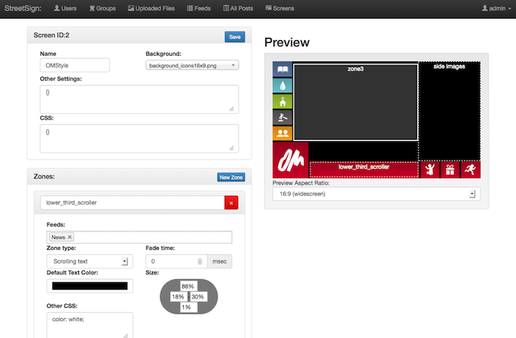
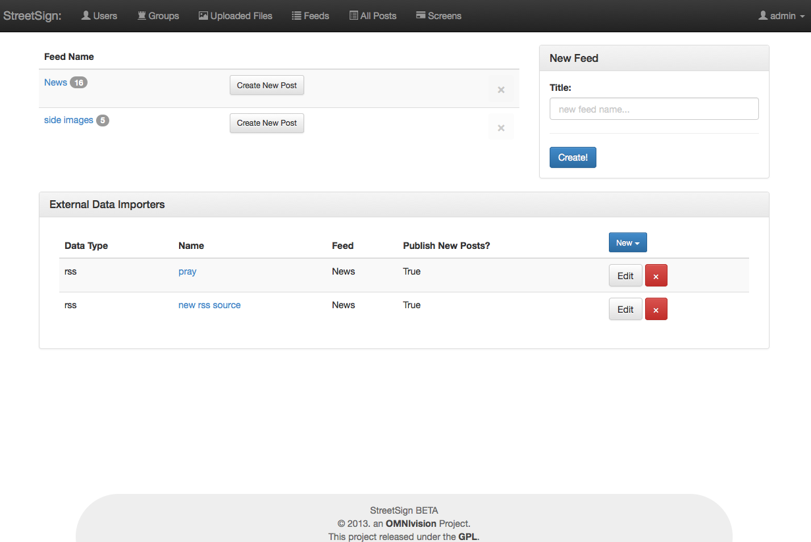

Welcome to StreetSign's documentation!
======================================

`StreetSign <https://bitbucket.org/dfairhead/streetsign-server>`_ is a Digital
Signage System, build using `Python`_, `Flask`_, and a bunch of :doc:`wonderful libraries<external_libs>`,
designed to be as simple and friendly as possible.

This documentation is a work in progress.

Contents:

.. toctree::
   :maxdepth: 3

   getting_started
   screen_options
   admin_guide
   deployment
   developer-overview
   developer-reference
   external_libs

Indices and tables
==================

* :ref:`genindex`
* :ref:`modindex`
* :ref:`search`

