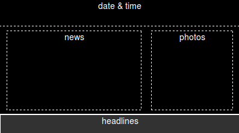
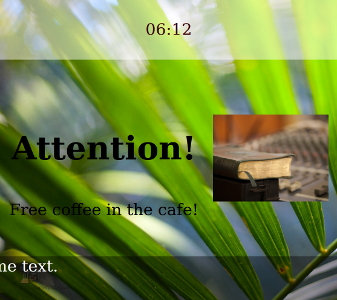
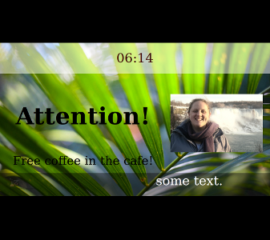

Screen Design
=============

"Screens" are where your posts actually get displayed.

A "Screen" output is actually a URL on the streetsign server which you can point
a browser on client machines at.

Backgrounds
-----------

Are any normal web image file (jpg, png, gif...) and stored in the main 'uploaded files'
directory.

The picture will automatically scale to try and fill the screen as best as it can.  This
is usually what you want, but if you are using a design with exact spacing, it can be
useful to use the `Aspect Ratio` over-ride to force the screen to display it correctly.

Zones
-----

Each 'zone' is a block in your Screen which can display Posts from multiple Feeds.

The usual layout is a scrolling "headlines" zone at the bottom, a "date and time" zone
at the top, and a textual news zone on one side, and pictures on the other.

The reason that each zone can show multiple feeds is so that you can separate
your data "semantically".  You
can have a "Campus News" feed, a "Staff-only" feed, a "World News" feed, a
"daily photos" feed, and so on.  Then in your staff room(s), the screen can
show posts from all of those, but in the public cafeteria not show the staff only
feeds, and so on.

Types of Zone Animation
~~~~~~~~~~~~~~~~~~~~~~~

Zones can either be "Fade-in, Fade-out" type, or "scrolling".  Scrolling text is
currently limited to right-to-left (sorry Arabic & other RTL language groups - I'm
happy to work on it if there is a demand, just let me know). The scrollspeed can be
over-ridden using the `scrollspeed` option.

The fade-in/fade-out time can be set per zone on the screen editor.  This is a value
in milliseconds.

Size
~~~~

These 4 values are usually percentages, and are "distance from this side of the screen".
So setting them all to 0 would mean a zone that filled the screen completely.

Fonts
~~~~~

There are a few default commonly available font families listed, but you can also upload your
own .TTF fonts into the `user_files/fonts` directory, and they should then appear for you
to use.

Other CSS
~~~~~~~~~

You can use standard CSS settings such as `text-shadow`, `font-weight` etc. in here to
further style your zones.

Screen 'client aliases'
-----------------------

As well as the Layouts described above, you can also set up "client aliases" which can be
changed to point at different layouts, with different options, without the URL (and so the
client configuration) needing to be changed.  These aliases are edited on the 'screens'
section, and can be set to appear on the front 'dashboard' as well, if you choose.

Screen "over-ride" Options
--------------------------

Sometimes it's useful to be able to force certain settings on a screen view. These
over-ride options can be set by passing them in the URI query string::

    http://streetsign-server/screens/basic/Default?options=go_here&more=can_to!

One useful combination for some lower powered machines is::

    ?fadetime=0&scrollspeed=20

These can all be set as part of a client alias, which would result in a simpler URL
such as::

    /client/dining-hall

for instance.

Here are all the options, and how to use them:

Aspect Ratio
~~~~~~~~~~~~

By default each screen will display at 'full screen', stretching all the zones out to fill
the screen.  This is usually what you want, but not always.

``forceaspect`` lets you force the aspect ratio of the screen.  This will usually end up
letterboxing on the screen.  This is really useful when you are using the same Screen
on 4:3 projectors as well as 16:9 displays, or when you are testing / designing a view
for one aspect ratio while using a screen with a different one ::

    http://streetsign-server/screens/basic/Default?forceaspect=1.7777

for instance will force the aspect ratio to 1.7777 - which is 16:9.

By default, the picture will then be centered vertically inside the browser window.

``forcetop`` lets you then force the top of the active picture to whereever you want.
so::

    http://streetsign-server/screens/basic/Default?forceaspect=1.7777&forcetop=0

will force a 16:9 image at the top of the display, rather than centering it vertically.

Fade Time
~~~~~~~~~

You can over-ride all zone fade times using the ``fadetime`` option. ::

    http://streetsign-server/screens/basic/Default?fadetime=0

for instance will disable fading between posts.  This is very useful for
underpowered clients, where you want to turn off effects and fading, but
don't want to disable the effects for other more powerful clients which are
also using that screen URL.  Fadetime is an integer value in milliseconds.
So 2000 is 2 seconds, 20000 is 20 seconds, 200 is .2 of a second, and so on.

Scroll Speed
~~~~~~~~~~~~

You can over-ride the scrolling text speed for all scrolling zones using the
``scrollspeed`` option::

    http://streetsign-server/screens/basic/Default?scrollspeed=30

Will scroll quite a lot slower.

The default speed is '17', lower numbers are faster, and higher numbers are
slower.  Why 17?  Well, it just seemed like a reasonable compromise speed that
looks decent in most places.
